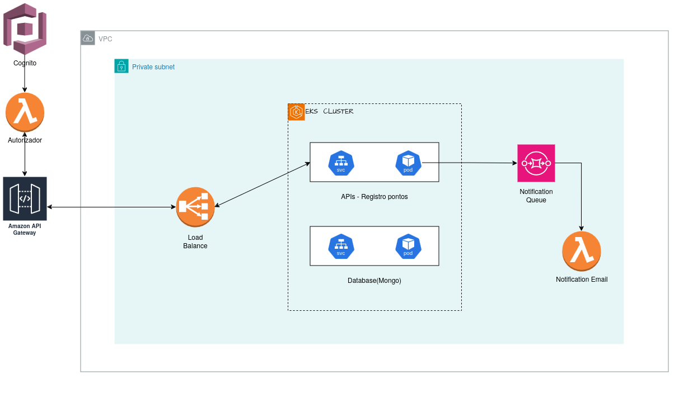

# PROJETO FIAP TECH HACKATHON

Sistema de registro de horário de entrada, intervalos e saída de funcionários (registro de ponto).
Curso de pós-graduação em arquitetura de software da FIAP - turma II/2023.

Membros do grupo 30:
- Diórgenes Eugênio da Silveira - RM 349116
- Elton de Andrade Rodrigues - RM 349353
- Gabriel Mendes - RM 348989
- Juliana Amoasei dos Reis - RM 348666

## Repositórios

- [Monolito da aplicação](https://github.com/EltonARodrigues/fiap-tech-Hackathon)
- [Serviço de envio de emails](https://github.com/JulianaAmoasei/fiap-hackathon-lambda-email)
- [Autenticação de usuários](https://github.com/EltonARodrigues/tech-fiap-hackathon-auth)

## Vídeo demonstrativo da aplicação

O vídeo com a demonstração do MVP pode ser acessado [aqui](__LINK__):

- criação de novo registro de ponto de usuário já registrado no sistema
- endpoint de acesso aos dados (limitado aos dados do próprio usuário logado)
- endpoint de solicitação de envio de espelho de ponto por e-mail, com contagem de horas trabalhadas e intervalos

## Arquitetura do projeto

O MVP (fase 1) foi desenhado de forma a já contemplar as implementações futuras (fase 2).


Conforme o diagrama, os elementos estão identificados de acordo:

- implementação (fase 1 e fase 2)
- domínios (`registro` e `usuários`)
- arquitetura utilizada (monolito e serverless)
- separação de serviços (autenticação, emails e notificações, manutenção dos registros)
- gerenciamento de acessos, autenticação e requisições (AWS Cognito, AWS API Gateway, AWS Lambda, AWS SQS, endpoints REST)

Segue abaixo detalhamento de cada parte do MVP.

### Serviço principal

Considerando as especificações e requisitos do projeto, a funcionalidade principal do MVP foi desenvolvida com base na arquitetura de monolito. Para garantir a segregação das responsabilidade, desacoplamento, manutenabilidade, escalabilidade e testes, levando-se em consideração futuras implementações, foi utilizado o princípio de **ports and adapters** para o desenvolvimento dos domínios e seus módulos correspondentes.

```sh
.
└── src
    ├── controllers
    ├── datasources
    │   ├── databaseNoSql
    │   │   ├── config
    │   │   ├── models
    │   │   ├── repository
    │   │   └── seed
    │   └── queues
    ├── domain
    │   ├── entities
    │   ├── repositories
    │   └── useCases
    ├── handlerError
    ├── presenters
    │   └── api
    │       ├── config
    │       │   └── interfaces
    │       ├── middleware
    │       └── routers
    └── @types
        └── express
```

### Armazenamento dos dados

Observando as necessidades do domínio principal, de registro, foi escolhido o MongoDB (NoSQL) para armazenamento dos dados, devido à necessidade de acesso rápido a registros, busca e retorno de listas de registros, inclusão de novos registros e eventual inclusão de propriedades (como pedidos de alteração, autorização de alteração e identificação de usuários autorizados) em registros já criados.

### Integração dos serviços

Além da inclusão de registro e endpoint de visualização dos registros, o MVP também implementa um serviço de envio de registro com cálculo de horas trabalhadas por email. Considerando que é um serviço com menor índice de acessos constantes e com picos específicos de acesso (por exemplo, em datas específicas do mês), o serviço foi implementado à parte do serviço principal, através de uma função lambda. As requisições são manejadas através de mensageria, garantindo que o sistema principal se encarregue apenas da funcionalidade principal (criação e acesso aos registros de ponto).

### Autenticação

A autenticação de usuários foi separada do serviço principal e é gerenciada pelos serviços de cloud AWS Cognito e API Gateway, em função de escalabilidade, performance e implementações de segurança:
- serviço contido em função Lambda acessada via HTTP (picos flutuantes de acesso e menor quantidade de acessos simultâneos)
- grupos de usuários e roles
- gerenciamento de autenticação de usuários e permissões
- gerenciamento de rotas protegidas e tokens de acesso

## Infraestrutura



Para garantir o desempenho, a resiliência, disponibilidade e escalabilidade da aplicação nos momentos de picos de acesso, assim como a confiabilidade na persistência dos dados, serão utilizados os seguintes serviços e ferramentas:
- AWS Lambda + AWS Cognito
  - Autenticação de usuários
- AWS Lambda + AWS SQS
  - Mensageria para gerenciamento de pedidos de relatório por email
- AWS API Gateway
  - load balancer para balanceamento e dimensionamento de carga em picos de acesso
- Docker, Kubernetes e AWS EKS (Elastic Kubernetes Service)
  - Docker para compartimentação da aplicação principal e banco de dados em contêiners independentes
  - Kubernetes para orquestração e gerenciamento dos processos de deploy, execução, configuração e conexões dos contêiners
  - AWS EKS para gerenciamento de escalabilidade, disponibilidade e observabilidade dos contêiners orquestrados com Kubernetes